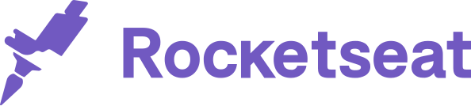

<h4 align="center">
 
  
</h4>

 

### :rocket: Tecnologias usadas
Este projeto foi desenvolvido com as seguintes tecnologias:
- [Node.js](https://nodejs.org/en/)
- [Expo](https://expo.io/)
- [Express](https://expressjs.com/pt-br/)
- [ExpressJs](https://expressjs.com/pt-br/)
- [Nodemon](https://www.npmjs.com/package/nodemon)
- [Axios](https://www.npmjs.com/package/axios)
- [Cors](https://www.npmjs.com/package/cors)
- [Eslint](https://www.npmjs.com/package/eslint)
- [Jest](https://www.npmjs.com/package/jest)

### :computer: Projeto

<b>Be the Hero</b> é uma aplicação de Gerenciamento de Atividades para ONGs (Projeto Semana Omnistack 11.0 Rocketseat). 

### 🦸‍♂️ Qual a importância de ajudar uma ONG?  
As organizações não governamentais <b>(ONGs)</b> são entidades privadas da sociedade civil, sem fins lucrativos, cujo propósito é defender e promover uma causa. Essa causa pode ser virtualmente de qualquer tipo: <b>direitos humanos</b>, <b>direitos animais</b>, <b>direitos indígenas</b>, <b>gênero</b>, <b>luta contra o racismo</b>, <b>meio ambiente</b>, <b>questões urbanas</b>, <b>imigrantes</b>, entre muitos outros.

### :recycle: Como contribuir

- Fork esse repositório;
- Crie uma branch com a sua feature: `git checkout -b my-feature`
- Commit suas mudanças: `git commit -m 'feat: My new feature'`
- Push a sua branch: `git push origin my-feature`

### :memo: Licença

Esse projeto está sob a licença MIT. Veja o arquivo [LICENSE](LICENSE.md) para mais detalhes.

### :muscle: Referências

- [Rocketseat](https://rocketseat.com.br/)
- [Diego Fernandes](https://github.com/diego3g)
- [João Carli](https://github.com/fl4m3x)

---
